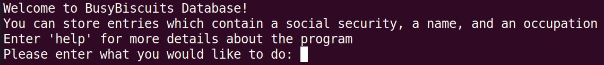
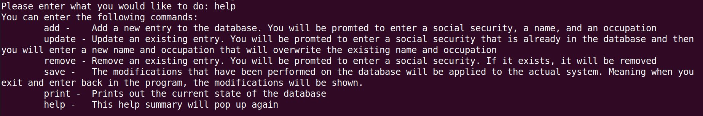
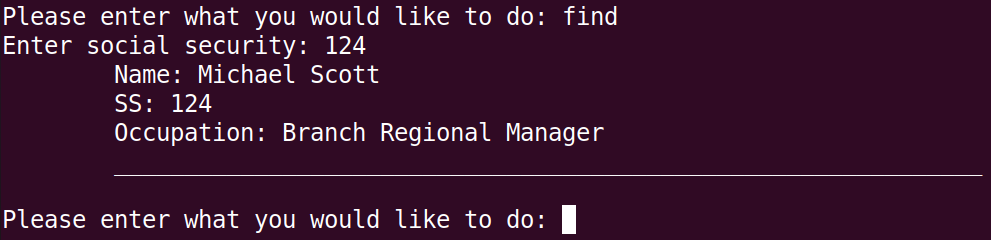
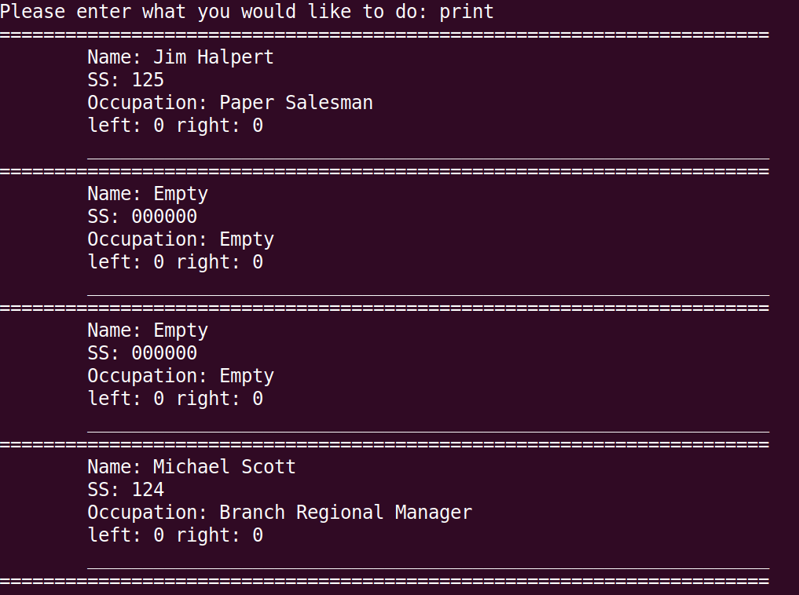

# BusyBiscuits - Time Tracking Web Application

## Table of contents
1. [Building the project](#build)
2. [Techstack](#stack)
3. [What am I looking at?](#description)
4. [Inspiration](#inspiration)
5. [Possible future additions](#future)
6. [Screenshots of the application](#screenshots)


## Building the project <a name="build"></a>
- Using CMake for builds. Create a builds folder by executing **mkdir build** at the root of the project. Then the file structure should look like the following:
 ```text
BusyBiscuits_Database
    +---src
    +---build               <------ New Folder
    +---.gitignore
    +---CMkakesList.txt
    +---readme.md
    +---LICENSE
    +---(And then some other files and folders)
```
- There are bash scripts used to utilize the CMake files. Then you can execute the GenerateMakeFiles.sh file to use CMake to generate the make files for both the main program and for the tests
```
./GenerateMakeFiles.sh
```
- If you want to run the main program, execute the following command
```
./MainMakeFilesExecute.sh
```
- If you want to run the tests, execute the following command
```
./TestMakeFilesExecute.sh
```

## Techstack <a name="stack"></a>
- Used Visual Studio Code as my editor
- Ubuntu as the OS
- Make sure you have **CMake** on your computer
    - On Ubuntu, the command is **sudo apt-get install cmake**

## What am I looking at? <a name="description"></a>
- This is a modest database that is built in C++. Its a console application so everything is done through the command line. It is meant to store data entries with three fields - a social security, a name, and an occupation. You can add, remove, update, and read from the database. 
- Theres two main parts to the database. The first part is the text file that holds the data for when the application is not running. The second part is data structure that I built from scratch that allows for faster access during run time. 
    - The data structure is a hash table where each 'bucket' points to a root of a binary tree. So when there is collision in the table, it will be placed in the binary tree for a O(log(n)) lookup time. 
- Since I built this application in Linux, I used CMake to generate Make files that would help build and create executables. I also wrote some shell scripts to automate some of these tasks even more. 
- There are also some unit tests that have been build using Catch2. These tests verify the CRUD operations performed on the data structure.  

## Inspiration <a name="inspiration"></a>
I wanted to get a more robust lower-level understanding of data structures and decided a cool way to do so is to create a database. It's no SQL, but it's mine. Also, on the last day in my data structures course a few years ago, my professor mentioned this would be a great project to get better with not just data structures but with C++ as well. Then I chose Linux as my development environment just because I wanted to get more comfortable with it. 

## Possible future additions <a name="future"></a>
(This is more of a note for myself just in case I ever want to come back to this project.) When I first started this application, my MVP was to just implement a hash table that points to a binary tree and have it act like a 'database'. But as I kept working on the project, I kept wanting to add features such as an actual way to store the data when the application is off. 

However, the following are things I would add if I ever wanted to keep working on this project: 

- A more robust 'find' feature allowing for the program to search based on name or occupation. 
- A stronger and more complex hash function
- A way to allow the user to create fields instead of the hard coded three (social security, name, and occupation)
- A GUI
- A way to distribute the program

## A few screenshots of the application <a name="screenshots"></a>

### Greeting from the initial open of the application ###


### help command ###
 

### add command ###
 

### update command ###
 

### remove command ###
 

### find command ###
 

### print command ###
The hash table, for development purposes, was set to a length of 4 buckets. I wanted there to be more collisions so that I can see the behavior of the data structure. I know in a real-life scenario, the more buckets, the better the performance is.
 

### save command ###
 
